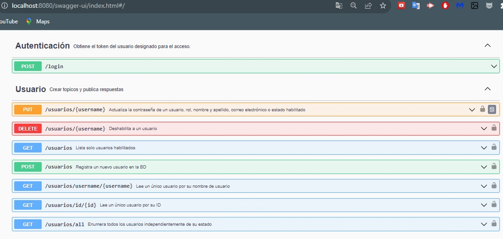
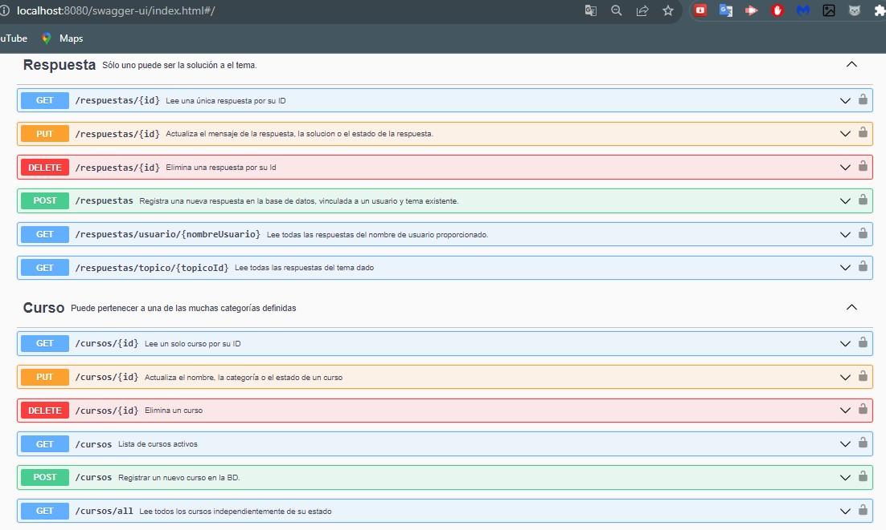
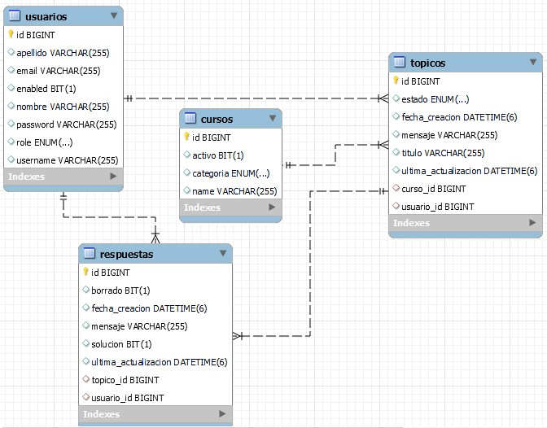

# Challenge-Foro-Hub
## Índice

* [📜 Descripción del proyecto](#descripción-del-proyecto)

* [📝 Estado del proyecto](#estado-del-proyecto)

* [🖥️ Características y demostración del Proyecto](#características-y-demostracion-Proyecto)

* [📖 Acceso al proyecto](#acceso-proyecto)

* [🖥️ Tecnologías utilizadas](#tecnologías-utilizadas)

* [💙 Personas Contribuyentes](#personas-contribuyentes)

* [Licencia](#licencia)

# 📜 Descripción del proyecto
<pEl Foro de Alura es un espacio colaborativo donde los estudiantes de la plataforma pueden publicar sus consultas sobre los cursos. Este entorno dinámico fomenta el aprendizaje mutuo y la cooperación entre alumnos, instructores y moderadores.

Conocemos la función y apariencia del foro, pero ¿qué hay detrás de su funcionamiento? ¿Dónde se guarda la información? ¿Cómo se gestionan los datos para vincular un tema con sus respuestas, o conectar a los usuarios con las réplicas de un tópico?

Este es nuestro reto: recrear a nivel de backend este mecanismo desarrollando una API REST con Spring.

Nuestra API se concentrará específicamente en la gestión de tópicos y deberá permitir a los usuarios:

Crear nuevos tópicos

Listar todos los tópicos existentes

Visualizar un tópico en particular

Actualizar un tópico existente

Eliminar un tópico</p>


### Lo que se solicitó Foro Alura:
1. Sistema de autenticación para el usuario para que pueda gestionar los recursos.
2. Permitir Mostrar todos los datos, mostrar dato especifico, crear, editar y eliminar un Topico, Respuesta, Curso o un Usuario.
3. Base de datos para almacenar todos los datos pedidos anteriormente.


# 📝 Estado del proyecto
<p>
   
</p>

# 🖥️ Características y demostración del Proyecto
### Tablas de la Base de Datos Foro Alura:
- Recomendacion: Crear primero la BD y sus tablas luego codificar en Eclipse o Intellij IDEA.

## Documentacion del proyecto
1. Funcionalidades




* Enlaces TRELLO de referencia:
  * https://trello.com/b/lj8N7Ng9/foro-alura-challenge-one-springboot
* Diseño de la BD: 
  * 
    
### Video del funcionamiento de la aplicacion
[](https://www.youtube.com/watch?v=3ivkN_BYxM8)

# 📖 Acceso al proyecto
### ¿Cómo descargar?
### Pasos principales:
#### ⭐Marca este proyecto con una estrella 

#### 🔹 Fork
1. Haga el **Fork** del proyecto. En la parte superior derecha, al hacer clic en el icono, creará un repositorio del proyecto en su cuenta personal de GitHub.

#### 🔹 Clonar el repositorio

1. Clonar repositorio:

```zsh
git clone https://github.com/Gerson121295/Challenge_Foro_Alura.git
```
2. Ir al directorio del proyecto:

```zsh
cd Challenge_Foro_Alura
```
3. Abrir el proyecto en Intellij IDEA:

```zsh
Listo
```

# 🖥️ Tecnologías utilizadas
- ☕ Java 17
- JPA Hibernate
- [Intellij](https://www.jetbrains.com/idea/)
- [MySql](https://www.mysql.com/)
- [Java](https://www.java.com/en/)

- [Spring Security](https://start.spring.io/)
- [Token JWT](https://jwt.io/)

## ⚠️ Importante! ⚠️
☕ Usar Java versión 8 o superior para compatibilidad. </br></br>
📝 Recomiendo usar el editor de Intellij</br></br>
